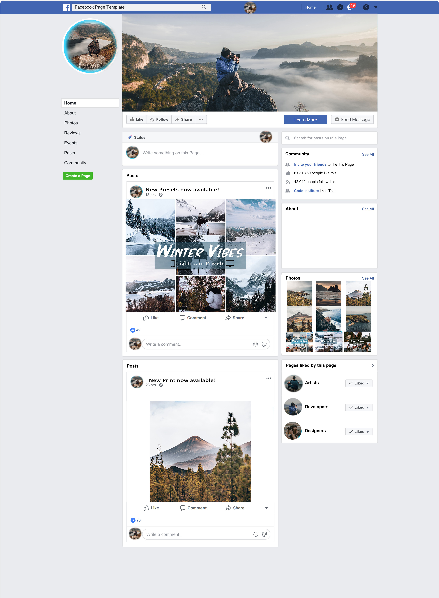

Artful Visions
=

Introduction
=

Artful Visions is a Photography E-Commerce website with a fully functioning payment system. Users accessing this website will be able to add a product to their cart, Add a discount code, and purchase products. Users can leave reviews on products and add a testimonial that the admin can accept to be placed on the home page.

The website can be viewed here: [Artful Visions](https://artful-visions-e583fd12b6db.herokuapp.com/ "Artful Visions").

# Table of contents
- [User Experience](#userexperience)
- [Marketing](#marketing)
- [Agile Development](#agile)
- [Features](#features)
- [Future Ideas / Development](#future)
- [Testing](#testing)
- [Deployment](#deployment)
- [Technologies Used](#technologies)
- [Credits](#credits)

User Experience
=

## **User Stories**
- ## **As a website owner I want that:**

    1. The website provides an easy and friendly experience when browsing the website.
    2. The website alerts the user/admin when they complete an action ie. register/purchase/update/delete.
    3. The website allows the user to purchase products and see previous customer reviews.
    4. The website allows the user to search and sort products.
------

- ## **As a website user I want:**
    1. To easily understand how to navigate the website (Site Pagination).
    2. Confident that the payment system is safe and secure. (Stripe)
    3. Any actions that the user does gets displayed as alerts.
    4. To be able to register an account.
    5. To search for a product.
    6. To receive an order confirmation if I make a purchase.
    7. Select quantity and size (if available).
 ------

- ## **As a returning website user I want:**
    1. To be able to view my previous orders.
    2. To be able to purchase another product.
    3. To be able to leave a review of the product that was purchased.

# 1. Strategy

- The main purpose of this website is so users can browse products and purchase them.
- Each user can create an account so they can view their previous orders.
- Users can leave reviews and a testimonial.

# 2. Scope
- After a few design choices. A simple navigation bar with the link in the middle and account/registration and cart in the right was chosen for ease of navigation.
- Using UX design, mobile responsiveness, and simple color profile.

# 3. Structure
- The user would be greeted with a photo of the photographer and a call to action button.
- To buy a product they would have to browse to products add to the cart and then go to checkout.
- The users would be able to add a discount code to get a discount on the final price.
- The user would be alerted if the checkout was successful or that the checkout failed due payment error.
- The user could then see the previous orders that they have placed.
- On the profile page the user can add their information so that the checkout process is quicker and easier.
- Users can use the search feature to search for a product that they are looking for.

# 4. Skeleton
## **Design**
- The initial design was made using Wireframes.

    - 

## **Database ERD**
- The data model type used for this project is the Relational Model - User (Allauth), Profile, Product, Category, Review, Order, OrderLineItem.
- The ERD was created/designed using LucidChart.

    - 

# 5. Surface
 - ## **Color**
   - The basic color scheme would be Black, White and the accents would be Orange. The images would have a more 
     dominant orange color.
   - Buttons would be black and white, and when hovering over would change to the opposite color.

Marketing
=

## Business Model

## **Value Proposition**
- High-quality Prints: Offer a wide range of prints featuring various styles, and sizes, ensuring the best quality.
- Digital Presets: Provide digital presets that enable customers to enhance their photos easily, achieving professional results and saving time in the editing process.

## **Target Market**
- The main target audience will be B2C Focused.
- Photography Enthusiasts: Appeal to individuals passionate about photography, seeking high-quality prints to decorate their spaces and digital presets to enhance their photos.
- Social Media Users: Influencers, bloggers, and individuals who want to enhance their social media presence with aesthetically pleasing photos and presets.

## **Revenue Generation**
- Print Sales: Earn revenue through the sale of prints, charging prices based on factors like print size.
- Digital Preset Sales: Generate revenue by selling digital presets individually or in preset packs, considering factors like the complexity and uniqueness of the presets.

## **Distribution Channels**
- E-commerce Website: Establish an intuitive and user-friendly website with a secure payment system, allowing customers to browse, select, and purchase prints and digital presets conveniently.
- Digital Download: Provide a seamless digital download process for customers to access their purchased digital presets immediately upon completing the transaction.
- Shipping: Arrange for the safe packaging and shipping of physical prints, ensuring they reach customers in pristine condition.

## **Marketing and Promotion**
- Online Marketing: Utilize digital marketing strategies such as search engine optimization (SEO), content marketing, social media advertising, and email marketing to reach and engage with the target audience.

## **Facebook Mockup**
- A Facebook mockup page has been created to showcase the platform's latest updates, featured prints, digital presets, and promotional content. This will serve as a key marketing channel for reaching and engaging with potential customers.

- 

Agile Development
=

## Introduction
This project was developed using agile development by adding small features during the length of the project. All user stories were assigned labels (Must Have, Should Have, Could Have). They were assigned based on the importance of the project and its functionality.

The KanBan board can be accessed from the following link -
[Kan Ban Board](https://github.com/users/rinalds98/projects/4/views/1 "Kan Ban Board")

A Kanban board was created using GitHub projects where all the user stories were shown in a card format.
- 

Features
=

The website Artful Visions is a simple website that allows the user to purchase photos and Lightroom presets. Even though it looks very simple on the outside there are a lot of things working in the background so the user can have a pleasant experience while using the website.

- ## **Home Page**
    - When the user first accesses the website they are greeted with a simple homepage design with a background image of the photographer. The name of the photography store and a call to action to browse photography products. There is also a Nav bar to access different parts of the website such as shop, about, and FAQ. There is a 'My Accounts' button that has Log-In/Log-Out/Register buttons depending on the user's status. Finally, there is a shopping cart that dynamically updates as a user adds items to the shopping cart.
        - 

- ## **Product Section**
    - The product section shows products in a card style using Bootstrap. The user can see a photo of the product and pricing.
        - 

- ## **Product Detail Section**
    - The product detail section has a very simplistic design. It allows the user to select a size for the photo if applicable and they can add the quantity of the item they want. If a product doesn't have a size it will only show the quantity option.
        - 
    - Users can also leave reviews of products they have purchased.
        - 

- ## **Bag/Cart Section**
    - After the user has added an item to the bag. They can go to manage their cart in the bag section. It shows the item, quantity, and total price. They can also add a discount code to the order to receive a discounted price. If the user inputs the wrong discount code, the user will get an alert about it.
        -

- ## **Profile Section**
    - If the user has created an account. They will be able to access their profile. Here they can update their personal information and view previous orders.
        -

- ## **Testimonial Section**
    - In the profile section if the user wishes they can add a testimonial for the admin to review. if the admin accepts the testimonial it will get posted on the homepage.
        -

- ## **Checkout Section**
    - Once the user is happy with what they want. They proceed to the checkout section. Here the user will be asked to add in their personal details and credit card information. If the user has an account and wishes to save his information for further purchases he has the option to check a box.
        - 

- ## **Checkout Success Section**
    - After the user has successfully paid for their order. They will be shown the checkout success page. In essence, it's an order summary of the user's order.
        - 

- ## **Footer**
    - A very simple footer was chosen with a Facebook icon that links to the business's social account. they use 'target=_blank' so if the user clicks they won't navigate anyway from the website. the rel 'noopener' was added as this prevents the new page having any access to the tab/session that opened it, preventing common phishing attack vectors. There is also an embedded MailChimp newsletter signup feature.
        - 

Future Development
=

## **Further Development**
- Multiple Photos of a product.
- Users can update and delete their reviews.
- Users can update and delete their testimonials.
- Users can delete their accounts.

 ## **Reasons they are not currently not implemented**
- Due to the time constraints and scope of the project. I would not have enough time to develop and test these new functions before the project deadline.

Testing
=

## **Solved Bugs**
- The discount code wasn't reducing the total cost of the order properly at checkout success.
- The deployed version of the project didn't have the database properly set up through Elephant SQL.

## **Unfixed Bugs**
- once a user selects a rating if they click away or decide they want to write a review the star rating selection disappears.
This is purely aesthetical as the rating the user selected will still be posted to the database.
The way to fix this would be to use javascript for the star rating system rather than just CSS.

## **Validator Testing**

- **Python Validation**
    - PEP8online.com was down during testing so I installed pycodestyle in VSCode. Then I searched for Linter and selected 'pycodestyle'. This showed if I had any errors which as of deployment is error-free.

    - All code that was written by me in the following apps - (bag, checkout, discounts, home, products, profiles) is pep8 complaint. which are:
        - admin.py
        - forms.py
        - models.py
        - urls.py
        - views.py
    - While checking if everything was pep8 compliant I noticed the Django-provided code inside of the settings.py file was not.
    - There was only 1 line in the project written by me that was too long according to the linter check.
    

- **HTML Validator**
    - I ran my website through  [HTML Validator](https://validator.w3.org/ "HTML Validator") and received no errors.
    

- **CSS Validator**
    - I ran my website through  [CSS Validator](https://jigsaw.w3.org/css-validator/ "CSS Validator") and received no errors.
    

- **JS Validator**
    - I ran my website through  [JS Validator](https://jshint.com/ "JS Validator") and received no errors only undefined $ for jquery.

- **Console Errors**
    - There were no console errors found.
    

- **Lighthouse Check**
    - This was my Lighthouse check
    

## **Manual Testing**
The Following was tested manually and passed:
- **Navbar**
    - Artful Visions Logo brings the user back to the homepage.
    - User logged out:
        - Home link - works as intended bringing the user back to the home page.
        - Shop - brings the user to the products page.
        - My Account -> Log-In/Register - brings the user to the respective pages.
        - Search - Works as intended and searches the database with a query.
        - Cart/Bag - Works as intended by bringing the user to the Bag section. It also displays the total bag value if the user has something added to the cart.
        - Does not show 'Log-Out', 'My Profile, or (*'Product Management' - Only shows if a user is a superuser)* nav links
    - User Logged In:
        - Home link - works as intended bringing the user back to the home page.
        - shop - brings the user to the products page.
        - Search - Works as intended and searches the database with a query.
        - Cart/Bag - Works as intended by bringing the user to the Bag section. It also displays the total bag value if the user has something added to the cart.
        - Log-Out - brings the user to the log-Out page.
        - Does not show 'Log-In' or 'Register' nav links.

- **Homepage**
    - Call to action button
        - 'Shop Now' button works as intended - brings the user to the products page.
        - 'Buy Now' button works as intended - brings the user to the product detail page of the product.

- **Products Section**
    - If the Product Has Sizes
        - The smallest size price is shown with text displayed - "Starting From".
    - If the Product Doesn't Have Sizes
        - The correct price is shown and there is no text displayed - "Starting From".
    - if the User is a superuser
        - 2 options below each product are displayed ("Edit"/"Delete") and both work as intended.

- **Product Detail**
    - Product Has Sizes:
        - There will be an option that allows the user to select what photo size they wish to buy. The price gets updated accordingly.
    - Product doesn't have sizes:
        - The only option available will be the quantity selector.
    - The quantity selector only allows to select between 1-99.
    - "Keep shopping" button brings the user back to the products page.
    - "Add to Bag" button adds the product and selected quantity to the bag/cart.
    - If the user is logged in they will be able to add a review about the product.
    - If the user is not logged in they will only be allowed to view reviews.
    - if the User is a superuser
        - 2 options below each product are displayed ("Edit"/"Delete") and both work as intended.

- **Bag/Cart**
- All Nav links work as intended.
- If the shopping bag is empty:
    - text displayed - 'Your bag is empty
    - 'keep shopping' button works as intended.
- If items in shopping bag:
    - User can update the quantity of product. (Price is adjusted accordingly) - A message alert shows up.
    - Update / Remove buttons work as intended.
    - Plus / Minus buttons work as intended.
    - If the product has sizes it will be displayed beside the product name.
    - If the product doesn't have sizes it will display 'N/A'
    - If the same product but a different size is added to the bag. it will be a separate item in the bag.
    - If the user adds a discount code to the bag. the user can see the discount on the checkout page.
    - If the discount code is invalid, the user will be notified that the discount code is invalid.
    - Keep shopping and secure checkout buttons work as intended bringing the user to the respective pages.

- **Checkout**
    - Order summary is identical to bag including price.
    - If a discount is applied to the bag - It is displayed including the discounted price.
    - If the user has a profile and has saved details. - The details are in the order detail fields.
    - Adjust bag and complete order buttons to work as intended.
    - When the Complete Order button is pressed an overlay is displayed while payment is taken.

- **Stripe**
    - When checking payment logs on Stripe - the correct amount and payment confirmed
    - Webhooks correctly installed - webhook log status 200 for all instances.
    

- **Checkout Success**
    - When payment has been completed, an order summary is shown with all the correct information and prices.
    - the button that brings the user back to the products page works as intended.

- **Profile**
    - If the user adds personal information to the profile and clicks 'update information' the information is saved and it shows up at checkout the next time the user wants to purchase something.
    - A user can see previous orders that they have put through. Clicking on the order will reveal the order summary page.
    - If the user adds a testimonial, it will be sent to the admin panel where it can be either confirmed (to be added to the homepage) or deleted.

- **Product Management / Edit Product**
    - If a superuser tries to add a product it won't allow to add a product without Name and description.
    - if product 'has sizes' hasn't been checked:
        - If the price is added in the first section then this will be displayed.
    - if product 'has sizes' has been checked:
        - If size and price get added to the product sizes section they will be displayed.
        - If you add 2 of the same sizes. Both will be displayed but only the first price will be displayed no matter which of the duplicate sizes is selected.
        - individual sizes can be deleted.

- **Discount Codes**
    - Discount codes are added via the admin panel.
    - if a user inputs an invalid discount code an error message will be displayed.
    - If a user inputs a valid discount code a confirmation message will be displayed.
    - The discount will appear on the checkout page with a percentage.
    - On the checkout success page (order summary) If a discount code is used - It will show the code used and the discount percentage applied.

- **Log-In/Log-Out/Register Pages**
- The log-In/Log-Out/Register sections are managed by OAuth Library.

    - **Register page**
        - If a username has already been used the user will get an error stating that a user already exists with that name.
        - The user is required to have a username and password.
        - The password confirmation has to match.
        - The password can't be simple or a common name.
        - The sign-up button registers the user's account and they are logged in.
        - The sign-in link brings the user to the Log-In page.
    
    - **Log-In Page**
        - The user is required to have a username and password.
        - The password has to be correct.
        - The sign-up link brings the user to the register page.
        - The sign-in button logs the user on.
    
    - **Log Out Page**
        - Sign out page works as intended logging the user out of their account.

- **Footer**
    - Facebook social media icon works as intended bringing the user to the correct social media website (Facebook).
    - Facebook social media link has a 'target="_blank"' so it opens a new tab instead of navigating away from the website.

- **Alerts**
    - Alerts have been programmed to pop up as toasts that are True.

Deployment
=

**The website was deployed using Code Institute's GitHub template on Heroku. The steps to deploy are as follows:**
This project was deployed using GitHub and Heroku.

### **GitHub**

1. Start a new repository.
   - Log in to GitHub.
   - Create a new repository.
   - Choose Code Institutes Template.
   - Add a repository name and click "Create repository" at the bottom of the page.
   - Then, click the green code button to show the dropdown menu.
   - Copy the GitHub link to clone the repository.
   - In VSCode paste the link to clone the repository to VSCode.

### **VSCode and Django**

1. Install Django and other necessary libraries:
   - Use `pip3 install 'django<4'` to install Django.
   - Install any other required libraries.
2. Write your code.
3. Create a `.env` file for sensitive data and add it to the `.gitignore` file to prevent it from being publicly accessible.
4. Generate a `requirements.txt` file by running `pip3 freeze > requirements.txt`.
5. Create a `Procfile`.

### **Heroku**

1. Log in to Heroku.
2. Click the "New" button, then select "New app".
3. Choose a unique app name and region, then click "Create app".
4. Go to "Settings" and click "Reveal Config Vars". Here, enter all the sensitive data, database addresses, and other URLs used in the project.
5. Go back to the top and click on "Deploy".
6. Scroll down and click on "Connect to GitHub".
7. Scroll down and click on "Deploy Branch".
8. Once the app is built with Python and all the dependencies, you'll see a message that says "The app was successfully deployed".
9. Click on "View" to see the [Deployed Site](https://artful-visions-e583fd12b6db.herokuapp.com/ "Deployed Site").

### **AWS S3 Bucket Creation**

1. Sign up/Sign in for an Amazon Web Services (AWS) account.
2. Navigate to the S3 service in the AWS Management Console.
3. Click "Create bucket" and choose a unique name for your bucket.
4. Configure bucket settings.
5. Create an IAM user with programmatic access.
6. Save the IAM user's access key and secret access key, and add them as environment variables in your project and Heroku app.

### **Stripe Configuration**

1. Sign up/Sign in for a Stripe account.
2. Navigate to the "Developers" section and click "API keys".
3. Obtain your "Publishable key" and "Secret key" and add them as environment variables in your project and Heroku app.
4. In your Django project, configure the Stripe settings
5. Test your Stripe integration.

The live link can be found here [Artful Visions](https://artful-visions-e583fd12b6db.herokuapp.com/ "Artful Visions").

Technologies Used
=

- ## Languages
    - Html
    - CSS
    - Javascript
    - Python

- ## Frameworks and Tools Used
    - Django
    - Bootstrap
    - ElephantSQL
    - AWS
    - Github
    - Heroku
    - Balsamiq Wireframes
    - Python Library "ruff" - Python Linter
    - Python Library "Black" - Format code to PEP8 compliancy
    - OAuth - Account Management
    - Stripe
    - urllib3
    - Pillow
    - Django Crispy Forms
    - gmail - for email sending
    - canva (for photo editing) 

Credits
=
Main Homepage Photo
- https://unsplash.com/photos/jg-6ARMiaPM

About Me Photo
- https://unsplash.com/photos/DQPP9rVLYGQ

FAQ Section
- https://unsplash.com/photos/9qYKMbBCFjc

noimage.png
- Image taken from Code Institutes Boutique Ado walkthrough project

All other photos are my content and work.

## **Content**

Code Institute Boutique Ado walkthrough project boilerplate code.

CSS Tricks Code:
- https://css-tricks.com/snippets/css/css-triangle/ 
- https://css-tricks.com/css-link-hover-effects/